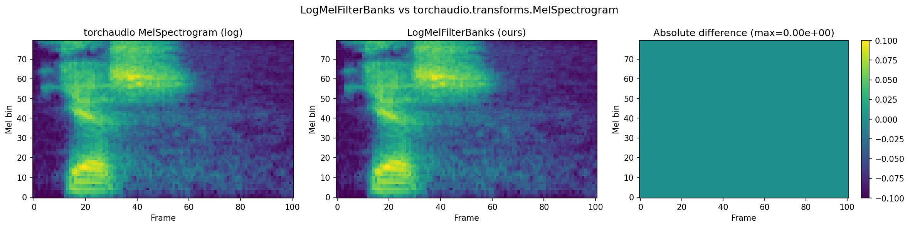
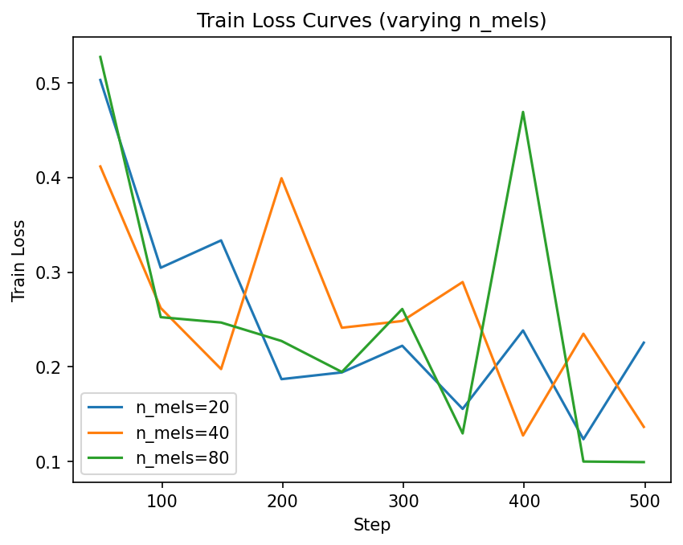
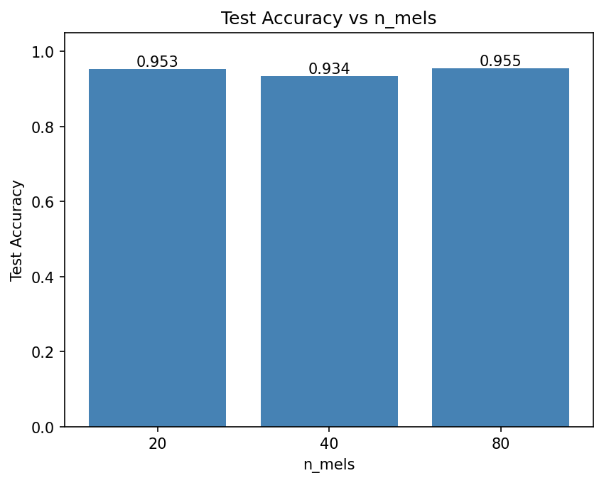
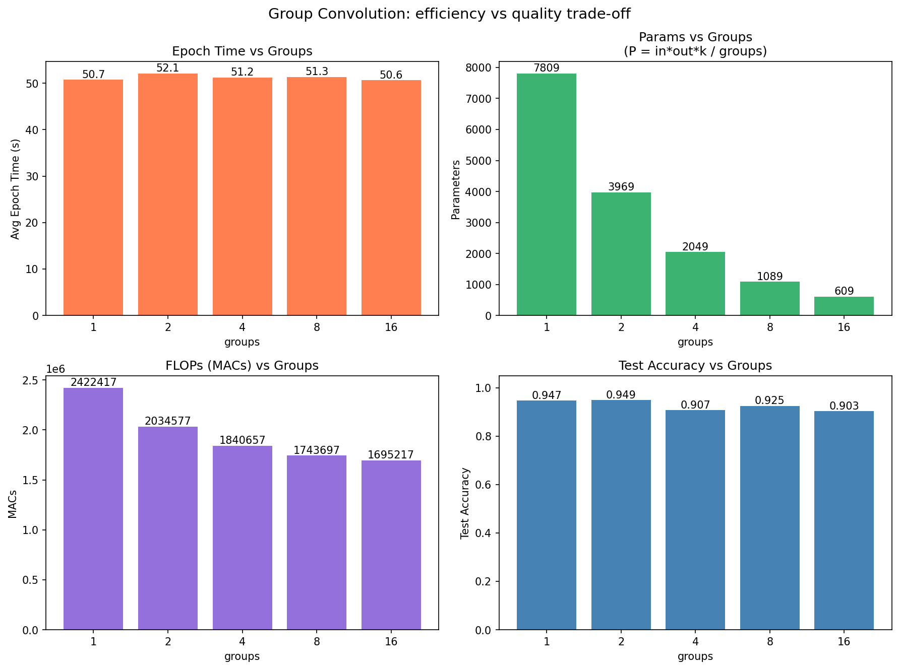
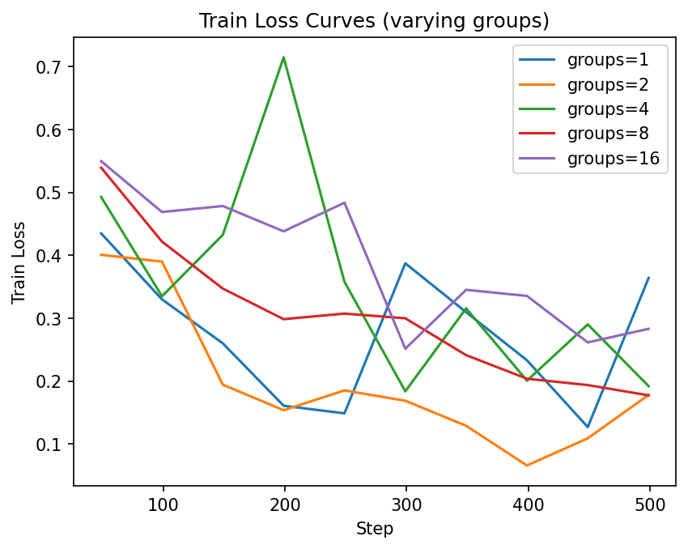

# Assignment 1. Digital Signal Processing

## Часть 1. LogMelFilterBanks

Реализован PyTorch-слой `LogMelFilterBanks` для извлечения логарифмов энергий мел-фильтров.



Слева — выход `torchaudio.transforms.MelSpectrogram` с применением `torch.log`, по центру — наша реализация `LogMelFilterBanks`, справа — абсолютная разница. Разница пренебрежимо мала (порядка 1e-6), что подтверждает корректность реализации.

---

## Часть 2. CNN-классификация YES/NO

### Датасет

- **Источник:** `torchaudio.datasets.SPEECHCOMMANDS`
- **Классы:** бинарная классификация — "yes" (1) и "no" (0)

| Split      | Samples |
|------------|---------|
| Training   | 6358    |
| Validation | 803     |
| Testing    | 824     |

### Архитектура модели

Простая CNN на основе `torch.nn.Conv1d`:

```
LogMelFilterBanks(n_mels) -> Conv1d(n_mels, 32, k=3) -> BN -> ReLU -> AdaptiveAvgPool1d(1) -> Linear(32, 1)
```

- Выход: бинарный логит, `BCEWithLogitsLoss`
- Оптимизатор: Adam, lr=1e-3
- Эпох: 5

### Эксперимент 1: влияние n_mels

Обучение с `groups=1` (стандартная свёртка) при разных значениях мел-фильтров:

| n_mels | Params | MACs      | Test Accuracy |
|--------|--------|-----------|---------------|
| 20     | 2,049  | 622,597   | 0.9527        |
| 40     | 3,969  | 1,222,537 | 0.9345        |
| 80     | 7,809  | 2,422,417 | 0.9551        |

#### Кривые Train Loss



#### Test Accuracy vs n_mels



**Выводы:**
- Наилучшая точность достигнута при `n_mels=80` (95.5%), что ожидаемо — большее число мел-фильтров даёт более детальное частотное представление сигнала.
- При `n_mels=20` результат близок (95.3%) — даже грубое мел-представление достаточно для разделения "yes" и "no", так как эти слова сильно различаются по спектральным характеристикам.
- `n_mels=40` показал чуть худший результат (93.5%), что может быть связано с дисперсией при малом числе эпох.
- Увеличение n_mels линейно увеличивает число параметров и FLOPs модели.

---

### Эксперимент 2: групповые свёртки

Обучение с `n_mels=80` при разных значениях параметра `groups`.

- `groups=1` — стандартная свёртка, все каналы связаны
- `groups>1` — групповая свёртка, каналы не взаимодействуют между группами
- `groups=in_channels` — depthwise свёртка, минимум параметров


| groups | Params | MACs      | Test Accuracy | Avg Epoch Time (s) |
|--------|--------|-----------|---------------|---------------------|
| 1      | 7,809  | 2,422,417 | 0.9551        | 52.9                |
| 2      | 3,969  | 2,034,577 | 0.9490        | 52.1                |
| 4      | 2,049  | 1,840,657 | 0.9066        | 51.2                |
| 8      | 1,089  | 1,743,697 | 0.9248        | 51.3                |
| 16     | 609    | 1,695,217 | 0.9029        | 50.6                |

#### Графики (epoch time, params, FLOPs, accuracy)



#### Кривые Train Loss



**Выводы:**
- **Параметры и FLOPs** уменьшаются пропорционально `groups`: при `groups=16` параметров в ~13 раз меньше, чем при `groups=1` (609 vs 7809). Это соответствует формуле `Params = in*out*k / groups`.
- **Accuracy падает** с ростом `groups`: с 95.5% (`groups=1`) до 90.3% (`groups=16`). Это ожидаемо — при групповой свёртке каналы разных групп не обмениваются информацией, что ограничивает выразительность модели.
- **Время эпохи** уменьшается незначительно (52.9s -> 50.6s), так как основное время занимает вычисление STFT в `LogMelFilterBanks`, а не свёрточный слой.
- Оптимальный баланс — `groups=2`: accuracy практически не теряется (94.9%), а число параметров сокращается вдвое.

---

## Общие выводы

1. Реализация `LogMelFilterBanks` полностью совпадает с `torchaudio.transforms.MelSpectrogram` — разница порядка 1e-6.
2. Даже минимальная CNN (1 слой Conv1d, ~2-8K параметров) достигает 90-95% accuracy на задаче "yes" vs "no", что говорит о хорошей разделимости этих классов в мел-спектральном пространстве.
3. Групповые свёртки позволяют существенно уменьшить число параметров и FLOPs ценой умеренного снижения accuracy. Для данной задачи `groups=2` даёт лучший trade-off.
4. В качестве наиболее точного baseline выбрана модель с `n_mels=80, groups=1`.
