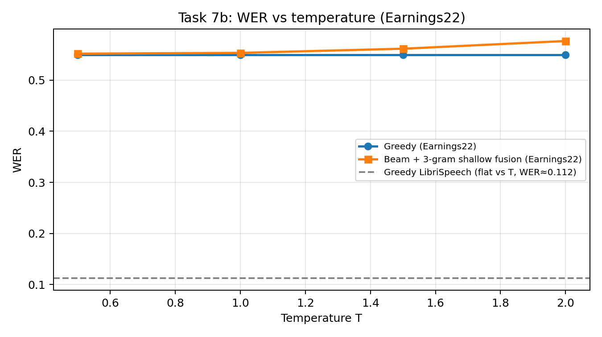

# Assignment 2 — Wav2Vec2: greedy, beam, KenLM (shallow fusion, rescoring)

**Модель:** `facebook/wav2vec2-base-100h`  
**Оценка:** LibriSpeech `test-other` (200 фраз), Earnings22 test (200 фраз)  
**LM:** KenLM — pruned Libri 3-gram (`lm/3-gram.pruned.1e-7.arpa.gz`), опционально OpenSLR 4-gram, доменный 3-gram по `earnings22_train` (`lm/financial-3gram.arpa.gz`).

**Код:** `wav2vec2decoder.py` — `greedy`, `beam`, `beam_lm`, `beam_lm_rescore`; температура масштабирует акустические логиты до `log_softmax`.

**Воспроизведение:** см. `README.md` (пути к `data/`, команды `run_experiments.py`, `run_remaining_tasks.py`, `replot_task7b.py`, `export_qualitative_examples.py`).

---

## Краткое резюме

- На **Libri** beam и LM-схемы дают небольшой выигрыш относительно greedy; оптимальные **(α, β)** для shallow fusion и rescoring **различаются**.
- На **Earnings** наблюдается сильный **domain shift** (WER ~0.55 против ~0.11): Libri n-gram почти не помогает и иногда чуть ухудшает относительно чистого beam.
- **Shallow fusion** при слишком большом **α** катастрофически деградирует; **rescoring** остаётся устойчивее — LM не «ломает» поиск на каждом шаге.
- **Доменный financial LM** заметно улучшает Earnings при фиксированных гиперпараметрах; на Libri эффект слабый или смешанный.
- Если в методичке указан greedy WER ~**10.4%** на полном `test-other`, на **подвыборке 200** фраз метрики могут быть выше (~**11.2%**) — это нормальная дисперсия, не ошибка реализации.

---

## Task 1–2. Baseline и ширина луча (LibriSpeech)

| method | WER | CER |
|--------|-----|-----|
| greedy | 0.112 | 0.038 |
| beam (beam_width = 10) | 0.111 | 0.038 |

Sweep (`results_full/task2_beam_width_sweep.csv`): при увеличении ширины луча с 1 до 50 WER стабилизируется около **0.111** — дальнейшее расширение луча мало что даёт.

---

## Task 3. Температура × greedy (LibriSpeech)

На сетке **T ∈ {0.5, 0.8, 1.0, 1.2, 1.5, 2.0}** WER/CER для greedy **совпали** (`task3_temperature_sweep_librispeech.csv`): argmax по времени часто не меняется при монотонном перераспределении вероятностей. Смысл температуры сильнее виден в **beam + LM** на out-of-domain данных (Task 7b).

---

## Task 4 и 6. Сетка α, β (LibriSpeech)

Лучшие точки на сетке (heatmap: `task4_shallow_fusion_heatmap.png`, `task6_rescoring_heatmap.png`):

| Метод | α | β | WER | CER |
|-------|---|---|-----|-----|
| Shallow fusion (`beam_lm`) | 0.1 | 0.5 | **0.110** | **0.037** |
| Rescoring (`beam_lm_rescore`) | 0.01 | 1.5 | **0.110** | **0.037** |

### Стабильность к большим α (Libri)

При **α = 5** (край сетки) shallow fusion **сильно ломает** декодирование: WER растёт до **~0.35–0.50** в зависимости от β (`task4_shallow_fusion_grid.csv`).  
У **rescoring** при тех же α WER остаётся в диапазоне **~0.127–0.129** (`task6_rescoring_grid.csv`) — деградация умеренная.

**Интерпретация:** при fusion вес LM входит на **каждом** шаге расширения гипотез; завышенный α «перетягивает» путь в неверные n-gram’ы. Rescoring пересчитывает **уже построенные** гипотезы — риск «сломать» весь поиск ниже.

### Качественные примеры (Task 6)

Полный набор (8 фраз): **`results_full/task6_qualitative_examples.md`** (и `task6_qualitative_examples.csv`).

Кратко:

1. **«to day» vs «today»** (`sample_67.wav`): beam/SF дают *today* (ближе к разговорной норме), RS восстанавливает разбиение *to day*, совпадающее с REF после нормализации — видно расхождение **критериев** (акустика+LM на шаге vs финальный пересчёт).
2. **Склейки слов** (`sample_14.wav`): beam даёт *kickhe*; RS вносит *fore taste* вместо *foretaste* — LM «чинит» одно и портит другое.
3. **Имена / OOV** (`sample_33.wav`): *gurfather* → SF/RS разбивают на *gur father* — частичное исправление за счёт LM.

Команда пересборки примеров: `uv run python export_qualitative_examples.py` (см. README).

---

## Task 7. Четыре метода и сдвиг домена

Источник: `results_full/task7_domain_shift_comparison.csv`. Для LM-методов используются **лучшие (α, β) с Libri** (Task 4 / Task 6).

### Сводная таблица: метод × Libri × Earnings

| method | Libri WER | Libri CER | Earnings WER | Earnings CER |
|--------|-----------|-----------|--------------|--------------|
| greedy | 0.112 | 0.038 | 0.550 | 0.256 |
| beam | 0.111 | 0.038 | 0.549 | 0.254 |
| beam_lm | **0.110** | **0.037** | 0.553 | 0.254 |
| beam_lm_rescore | **0.110** | **0.037** | 0.553 | 0.254 |

**Вывод:** на Earnings WER ~**0.55** против ~**0.11** на Libri — выраженный domain shift; Libri 3-gram **не компенсирует** сдвиг и по WER не улучшает beam (слегка хуже).

---

## Task 7b. Температура на Earnings22 (greedy vs beam_lm)

Используются **лучшие параметры shallow fusion с Libri** (α = 0.1, β = 0.5). Числа: `results_full/task7b_temperature_earnings.csv`.

| T | greedy WER | beam_lm WER |
|---|------------|-------------|
| 0.5 | 0.550 | 0.552 |
| 1.0 | 0.550 | 0.553 |
| 1.5 | 0.550 | 0.561 |
| 2.0 | 0.550 | 0.577 |

**Greedy:** плато по WER (как на Libri, Task 3).  
**beam_lm:** рост T **ухудшает** WER — более «плоские» акустические вероятности усиливают влияние LM на каждом шаге и уводят гипотезы в неверный домен.

График WER(T) с горизонталью «плато» greedy и (при наличии) эталоном Libri:

Пересборка графика из CSV: `uv run python replot_task7b.py`.

---

## Task 5. 3-gram vs 4-gram (LibriSpeech)

Фиксированные **α = 0.1**, **β = 0.5** (как в `run_remaining_tasks.py`). Результаты: `results_remaining/task5_3gram_vs_4gram.csv`.

| LM | method | WER | CER |
|----|--------|-----|-----|
| 3-gram | beam_lm | 0.110 | 0.038 |
| 3-gram | beam_lm_rescore | 0.110 | 0.038 |
| 4-gram | beam_lm | 0.111 | 0.038 |
| 4-gram | beam_lm_rescore | 0.110 | 0.038 |

**Вывод:** на этой подвыборке 4-gram **не дал** устойчивого выигрыша относительно pruned 3-gram; отличия в пределах шума подвыборки.

---

## Task 8. Financial KenLM

3-gram по корпусу `data/earnings22_train/corpus.txt` → `lm/financial-3gram.arpa.gz` (логика в `run_remaining_tasks.py`, если файла ещё нет).

---

## Task 9. Два LM на обоих доменах

Разделение артефактов (как в задании и в скриптах):

| Файл | Содержание |
|------|------------|
| **`results_full/task9_lm_comparison.csv`** | `beam_lm` / `beam_lm_rescore` с **лучшими α, β с Libri** (Task 4/6) для **только Libri 3-gram** — 4 строки (Libri + Earnings). Чтобы дописать financial в этот же CSV, перезапусти `run_experiments.py` с `--financial_lm`. |
| **`results_remaining/task9_full_lm_comparison.csv`** | Сравнение **обеих** LM при **одинаковых** α = 0.1, β = 0.5 — основная таблица для Task 9 «два LM на двух доменах» в текущей сдаче. |

Таблица по **фиксированным** α, β (`task9_full_lm_comparison.csv`):

| dataset | LM | method | WER | CER |
|---------|-----|--------|-----|-----|
| Libri | librispeech_3gram | beam_lm | 0.110 | 0.037 |
| Libri | librispeech_3gram | beam_lm_rescore | 0.110 | 0.038 |
| Earnings | librispeech_3gram | beam_lm | 0.553 | 0.254 |
| Earnings | librispeech_3gram | beam_lm_rescore | 0.550 | 0.254 |
| Libri | financial_3gram | beam_lm | **0.109** | 0.038 |
| Libri | financial_3gram | beam_lm_rescore | 0.111 | 0.038 |
| Earnings | financial_3gram | beam_lm | **0.526** | 0.250 |
| Earnings | financial_3gram | beam_lm_rescore | 0.539 | 0.252 |

**Вывод:** financial LM **снижает WER на Earnings** при `beam_lm`; на Libri картина смешанная (лучше beam_lm, чуть хуже rescoring) — несовпадение домена и словаря.

Гистограммы: `results_full/task9_wer_bar.png`, `results_full/task9_cer_bar.png`.

---

## Артефакты для проверки

| Путь | Содержание |
|------|------------|
| `results_full/*.csv`, `*.png` | Tasks 1–4, 6, 7, 7b, 9; heatmaps; Task 7b curve; бары Task 9 |
| `results_full/task6_qualitative_examples.md` | Качественный разбор Task 6 |
| `results_remaining/task5_3gram_vs_4gram.csv` | Task 5 |
| `results_remaining/task9_full_lm_comparison.csv` | Task 9 (фиксированные α, β) |
